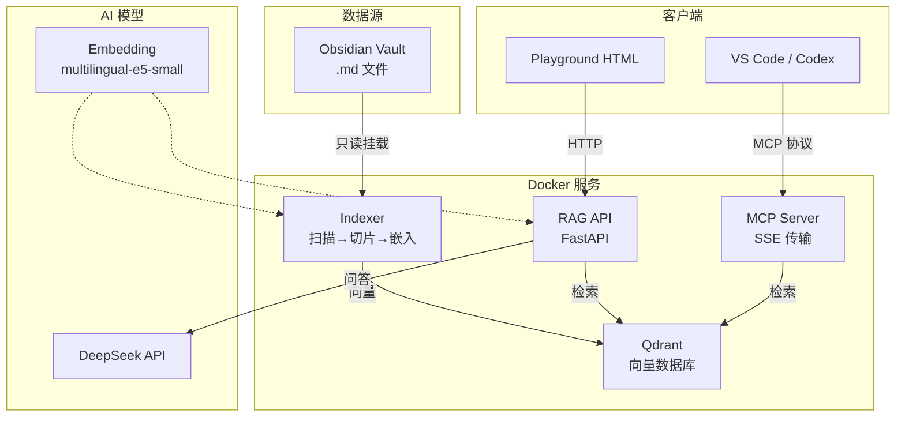

# AI RAG 系统配置指南

> 基于 Obsidian Vault + Qdrant + DeepSeek 的本地 RAG 方案

## 架构总览



## 前置需求

| 工具 | 版本要求 | 用途 |
|------|---------|------|
| Docker & Docker Compose | ≥ 24.0 | 运行所有服务 |
| DeepSeek API Key | - | LLM 问答 |
| Obsidian Vault | - | 知识库源 |

## 目录结构

```
ai-brain-rag/
├── docker-compose.yml     ← 4 服务编排
├── .env                   ← 环境变量模板（版本管理）
├── .env.local             ← 本地配置（已 gitignore）
│
├── indexer/               ← 自动索引服务
│   ├── Dockerfile
│   ├── config.py          ← 配置读取
│   ├── scanner.py         ← 扫描 vault，SHA256 哈希检测
│   ├── chunker.py         ← 按标题/段落切片（500字，50字重叠）
│   ├── embedder.py        ← 本地嵌入模型调用
│   └── indexer.py         ← 主循环：扫描→切片→嵌入→Upsert
│
├── rag-api/               ← HTTP 查询接口
│   ├── Dockerfile
│   ├── main.py            ← FastAPI 应用
│   ├── retriever.py       ← Qdrant 搜索
│   ├── responder.py       ← DeepSeek API 调用
│   └── models.py          ← 请求/响应模型
│
├── mcp-server/            ← MCP 协议服务
│   ├── Dockerfile
│   ├── server.py          ← FastMCP + SSE 传输
│   └── tools.py           ← 5 个工具实现
│
├── playground.html        ← 浏览器测试页面
│
└── data/
    ├── qdrant/            ← 向量持久化（挂载卷）
    └── model-cache/       ← 嵌入模型缓存（挂载卷）
```

## 启动步骤

### 方案 A：宿主机模式（推荐 🚀）

索引器在宿主机运行，直接调用 Ollama Metal GPU，速度比 Docker 内快 10 倍。

```bash
# 1. 启动 Docker 服务（Qdrant + API + MCP，不含 indexer）
cd ai-brain-rag
docker compose --env-file .env.local up -d qdrant rag-api mcp-server

# 2. 确认 Ollama 已运行
brew services start ollama
ollama pull nomic-embed-text

# 3. 启动宿主机索引器
bash run-indexer-host.sh
```

首次运行会自动创建 Python venv 并安装依赖。

### 方案 B：全 Docker（备选）

### 1. 配置环境变量

```bash
cd ai-brain-rag
cp .env .env.local
```

编辑 `.env.local`，填入必要参数：

```bash
# 你的 Obsidian Vault 路径
OBSIDIAN_VAULT_PATH=/Users/yuanzhe/Knowledge/AI-Brain

# DeepSeek API
DEEPSEEK_API_KEY=sk-your-key-here
DEEPSEEK_API_BASE=https://api.deepseek.com
DEEPSEEK_MODEL=deepseek-chat

# 嵌入模型
EMBEDDING_MODEL=intfloat/multilingual-e5-small
EMBEDDING_DIM=384
```

### 2. 启动所有服务

```bash
docker compose --env-file .env.local up -d
```

首次启动会下载模型文件（约 200MB），需要几分钟。

### 3. 验证服务

```bash
# 查看状态
docker compose ps

# 健康检查
curl http://localhost:8000/health

# 统计信息
curl http://localhost:8000/stats
```

预期输出：

```json
// health
{"status":"ok","qdrant_connected":true,"model_loaded":true,"deepseek_configured":true}

// stats
{"total_points":42,"collections":["ai-brain"],"embedding_model":"multilingual-e5-small","deepseek_model":"deepseek-chat"}
```

## 索引器工作机制

```
每 30 秒循环:
  1. 扫描 vault 所有 .md 文件
  2. 计算每个文件的 SHA256 哈希
  3. 对比上次记录，找出新增/修改/删除
  4. 新增/修改文件：
     a. 按标题层级切片（H1/H2/H3 感知）
     b. 超出 500 字的段落再切分（50 字重叠）
     c. 生成嵌入向量
     d. Upsert 到 Qdrant
  5. 删除文件：从 Qdrant 移除对应向量
  6. 保存哈希状态
```

**排除规则**：自动忽略 `.obsidian`、`.git`、`node_modules`、`__pycache__`、`Attachments/`、`99 Archive/` 目录。

## API 使用

### POST /search — 语义搜索

```bash
curl http://localhost:8000/search \
  -H "Content-Type: application/json" \
  -d '{
    "question": "Kafka 重试策略",
    "top_k": 5,
    "filters": {"folder": "03 Skills"}
  }'
```

### POST /ask — 搜索 + AI 问答

```bash
curl http://localhost:8000/ask \
  -H "Content-Type: application/json" \
  -d '{
    "question": "Kafka 重试策略是什么？",
    "top_k": 5
  }'
```

### GET /health — 健康检查

```bash
curl http://localhost:8000/health
```

### GET /stats — 统计

```bash
curl http://localhost:8000/stats
```

## MCP 配置（VS Code / Codex）

在 VS Code 的 `settings.json` 或 `.vscode/mcp.json` 中添加：

```json
{
  "mcpServers": {
    "ai-brain": {
      "url": "http://localhost:8100/sse"
    }
  }
}
```

### 可用工具

| 工具 | 说明 | 参数 |
|------|------|------|
| `search_knowledge` | 语义搜索知识库 | `query`, `top_k`(可选), `folder`(可选) |
| `read_note` | 读取完整笔记 | `filepath` |
| `list_notes` | 列出笔记 | `folder`(可选) |
| `get_project_context` | 获取项目上下文 | `project_name`, `top_k`(可选) |
| `get_skill` | 获取 Skill 文档 | `skill_name` |

## 嵌入模型说明

使用 `intfloat/multilingual-e5-small`：

| 属性 | 值 |
|------|-----|
| 向量维度 | 384 |
| 语言 | 多语言（含中文） |
| 大小 | ~200MB |
| 下载位置 | `data/model-cache/` |
| 首次下载 | 容器启动时自动下载 |

切换模型只需修改 `.env` 中的 `EMBEDDING_MODEL` 和 `EMBEDDING_DIM`。

## 日常使用

### 方式一：浏览器 Playground（推荐）

打开 `ai-brain-rag/playground.html`，这是最直观的使用方式：

1. 在左侧栏确认 API 地址为 `http://localhost:8000`
2. 选择模式：
   - **/ask** — 搜索笔记 + DeepSeek 生成回答（默认）
   - **/search** — 仅搜索相关笔记，不调 AI
3. 可选：按文件夹过滤（如 `03 Skills`、`05 Architecture`）
4. 在输入框提问，按 `Enter` 发送

**示例问题**：

```
PDF Skill 怎么用？
LinkTech 项目的前端设计规则有哪些？
Kafka 重试策略是什么？
Codex 的架构是怎样的？
Taste Skill 的三个旋钮是什么？
03 Skills 里有哪些安全相关的技能？
```

### 方式二：命令行 curl

适合脚本集成或快速测试：

```bash
# 快速搜索
curl -s http://localhost:8000/search \
  -H "Content-Type: application/json" \
  -d '{"question": "PDF Skill", "top_k": 3}' | jq .

# 只看指定文件夹
curl -s http://localhost:8000/search \
  -H "Content-Type: application/json" \
  -d '{"question": "部署", "top_k": 3, "filters": {"folder": "05 Architecture"}}'

# AI 问答
curl -s http://localhost:8000/ask \
  -H "Content-Type: application/json" \
  -d '{"question": "LinkTech 项目用什么技术栈？"}' | jq .answer
```

> 💡 搭配 `jq` 可以格式化输出。安装：`brew install jq`

### 方式三：VS Code / Codex MCP 集成

配置 MCP 后（见上方 MCP 配置节），在 VS Code 或 Codex 中可以直接提问：

```
@ai-brain 搜索 "Kafka 重试策略"
@ai-brain 帮我读取 03 Skills/taste-skill.md
@ai-brain 列出 05 Architecture 下的所有笔记
@ai-brain 获取 LinkTech-hydraulic 项目上下文
```

Codex Agent 会自动调用 `search_knowledge`、`read_note` 等工具来回答。

### 方式四：API 集成到其他工具

RAG API 是标准 HTTP 接口，可以集成到：

- **Raycast** — 用 Script 插件搜索知识库
- **Alfred** — 用 Workflow 调用 `/search`
- **终端 alias** — 加到 `.zshrc`：

```bash
alias kb="curl -s http://localhost:8000/search -H 'Content-Type: application/json' -d '{\"question\":\"\$*\",\"top_k\":5}' | jq ."
```

用法：`kb "Kafka 重试"`

## 查询技巧

| 目标 | 做法 |
|------|------|
| 搜指定领域 | 加 `filters: {"folder": "03 Skills"}` |
| 搜项目相关内容 | `filters: {"folder": "02 Projects/LinkTech-hydraulic"}` |
| 快速扫读 | 用 `/search`（不调 AI），只看标题和摘要 |
| 深度理解 | 用 `/ask`，让 DeepSeek 综合多篇笔记回答 |
| 确认索引进度 | `curl http://localhost:8000/stats` 看 total_points |
| 验证最新笔记已索引 | 修改后等 30 秒，再搜索验证 |

## 日常维护

```bash
# 查看索引器是否在工作
docker compose logs indexer --tail 20

# 查看向量数量
curl http://localhost:8000/stats

# 强制重新索引全部文件
# （删除 state 文件后重启 indexer）
docker compose exec indexer rm -f /tmp/indexer_state.json
docker compose restart indexer

# 查看 Qdrant  dashboard
open http://localhost:6333/dashboard
```

## 浏览器测试

打开 `playground.html` 即可使用图形界面测试。

## 服务管理

```bash
# 查看日志
docker compose logs -f          # 全部
docker compose logs -f indexer  # 仅索引器

# 重启单个服务
docker compose restart rag-api

# 停止
docker compose down

# 停止并删除数据（危险！）
docker compose down -v

# 重建特定服务
docker compose build mcp-server
docker compose up -d mcp-server
```

## 排错指南

| 症状 | 原因 | 解决 |
|------|------|------|
| Qdrant unhealthy | 容器无 curl | 使用 `bash /dev/tcp` healthcheck（已修复） |
| MCP Server 重启 | SDK API 变更 | 使用 FastMCP + SSE 传输（已修复） |
| 索引器报连接拒绝 | Qdrant 还没 ready | healthcheck 已加 `start_period: 15s` |
| 模型下载慢 | 首次下载 | 耐心等待，缓存到 `data/model-cache/` |
| playground 连不上 | API 端口不对 | 检查 `docker compose ps` 确认 8000 已映射 |

## 相关文档

- [[pdf-skill\|PDF Skill]]
- [[../05 Architecture/codex-system-architecture\|Codex 系统架构]]
- [[../06 Decisions/codex-config-decisions\|配置决策]]
- [[playwright-skill\|Playwright Skill]]
