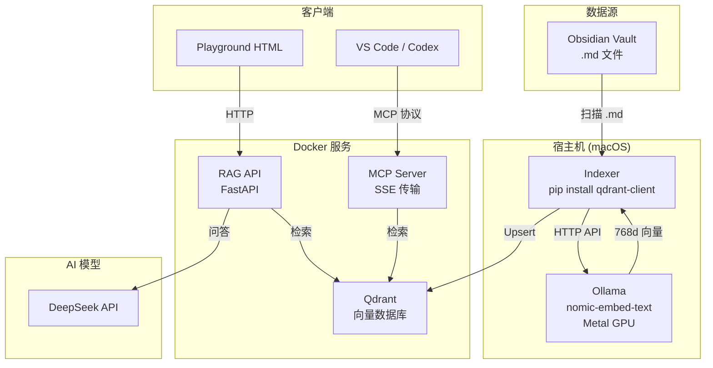

# AI RAG 系统配置指南

> 基于 Obsidian Vault + Qdrant + DeepSeek 的本地 RAG 方案

## 架构总览



## 前置需求

| 工具 | 版本要求 | 用途 |
|------|---------|------|
| Docker & Docker Compose | ≥ 24.0 | Qdrant + API + MCP 服务 |
| DeepSeek API Key | - | LLM 问答 |
| Ollama | ≥ 0.31 | 本地嵌入模型（Metal GPU 加速） |
| Obsidian Vault | - | 知识库源 |

## 目录结构

```
ai-brain-rag/
├── docker-compose.yml     ← 3 服务编排（不含 indexer）
├── .env                   ← 环境变量模板
├── .env.local             ← 本地配置（已 gitignore）
├── run-indexer-host.sh    ← 宿主机索引器启动脚本
│
├── indexer/               ← 索引器（宿主机运行）
│   ├── Dockerfile
│   ├── config.py          ← 配置读取
│   ├── scanner.py         ← 扫描 vault，SHA256 哈希检测
│   ├── chunker.py         ← 按标题/段落切片（500字，50字重叠）
│   ├── embedder.py        ← Ollama API 调用
│   └── indexer.py         ← 主循环：逐文件 chunk→embed→upsert
│
├── rag-api/               ← HTTP 查询接口
│   ├── Dockerfile
│   ├── main.py            ← FastAPI 应用
│   ├── retriever.py       ← Qdrant 搜索（Ollama 嵌入查询）
│   ├── responder.py       ← DeepSeek API 调用
│   └── models.py          ← 请求/响应模型
│
├── mcp-server/            ← MCP 协议服务
│   ├── Dockerfile
│   ├── server.py          ← FastMCP + SSE 传输
│   └── tools.py           ← 5 个工具（Ollama 嵌入查询）
│
├── playground.html        ← 浏览器测试页面
│
└── data/
    └── qdrant/            ← 向量持久化（挂载卷）
```

## 启动步骤

### 方案 A：宿主机模式（推荐 🚀）

索引器在宿主机运行，直接调用 Ollama Metal GPU，速度比 Docker 内快 10 倍。

```bash
# 1. 启动 Docker 服务（Qdrant + API + MCP，不含 indexer）
cd ai-brain-rag
docker compose --env-file .env.local up -d qdrant rag-api mcp-server

# 2. 确认 Ollama 已运行
brew services start ollama
ollama pull nomic-embed-text

# 3. 启动宿主机索引器
bash run-indexer-host.sh
```

首次运行会自动创建 Python venv 并安装依赖。

### 方案 B：全 Docker（备选，不推荐）

> ⚠️ Docker 内运行 indexer 无法使用 GPU，速度极慢。仅在没有 Ollama 的环境使用。

```bash
# 先把 docker-compose.yml 中的 indexer 注释去掉
# 然后:
docker compose --env-file .env.local up -d
```

预期输出：

```json
// health
{"status":"ok","qdrant_connected":true,"model_loaded":true,"deepseek_configured":true}

// stats
{"total_points":717,"collections":["ai-brain"],"embedding_model":"nomic-embed-text","deepseek_model":"deepseek-chat"}
```

## 索引器工作机制（宿主机模式）

索引器在 **宿主机** 直接运行（不是 Docker 内），通过 HTTP 调用 Ollama 获得 Metal GPU 加速。

```
每 30 秒循环:
  1. 扫描 vault 所有 .md 文件（排除 .obsidian/ .git/ node_modules/ 等）
  2. 计算每个文件的 SHA256 哈希
  3. 对比上次记录，找出新增/修改/删除
  4. 逐文件处理（chunk → embed → upsert，非批量）：
     a. 按标题层级切片（H1/H2/H3 感知）
     b. 超出 500 字的段落再切分（50 字重叠）
     c. 调用 Ollama API (/api/embed) 生成 768 维向量
     d. Upsert 到 Qdrant
  5. 删除文件：从 Qdrant 移除对应向量
  6. 保存哈希状态
```

宿主机 vs Docker 对比：

| 对比项 | Docker indexer | 宿主机模式 ✅ |
|--------|---------------|-------------|
| 嵌入硬件 | CPU 模拟 | Metal GPU |
| 49 文件处理时间 | 44 分钟卡死 | **10.2 秒** |
| 内存占用 | ~500MB | ~50MB |
| 依赖安装 | 内置 Dockerfile | `pip install qdrant-client` |

## 嵌入模型说明

通过 Ollama 使用 `nomic-embed-text`：

| 属性 | 值 |
|------|-----|
| 向量维度 | 768 |
| 语言 | 多语言（含中文） |
| 大小 | ~274MB |
| 硬件加速 | Apple Silicon Metal GPU |
| 每批速度 | **~16-29 ms/chunk** |

切换模型：
```bash
ollama pull <其他模型名>        # 下载新模型
# 然后修改 run-indexer-host.sh 中的 OLLAMA_EMBED_MODEL
```

### POST /search — 语义搜索

```bash
curl http://localhost:8000/search \
  -H "Content-Type: application/json" \
  -d '{
    "question": "Kafka 重试策略",
    "top_k": 5,
    "filters": {"folder": "03 Skills"}
  }'
```

### POST /ask — 搜索 + AI 问答

```bash
curl http://localhost:8000/ask \
  -H "Content-Type: application/json" \
  -d '{
    "question": "Kafka 重试策略是什么？",
    "top_k": 5
  }'
```

### GET /health — 健康检查

```bash
curl http://localhost:8000/health
```

### GET /stats — 统计

```bash
curl http://localhost:8000/stats
```

## MCP 配置（VS Code / Codex）

在 VS Code 的 `settings.json` 或 `.vscode/mcp.json` 中添加：

```json
{
  "mcpServers": {
    "ai-brain": {
      "url": "http://localhost:8100/sse"
    }
  }
}
```

### 可用工具

| 工具 | 说明 | 参数 |
|------|------|------|
| `search_knowledge` | 语义搜索知识库 | `query`, `top_k`(可选), `folder`(可选) |
| `read_note` | 读取完整笔记 | `filepath` |
| `list_notes` | 列出笔记 | `folder`(可选) |
| `get_project_context` | 获取项目上下文 | `project_name`, `top_k`(可选) |
| `get_skill` | 获取 Skill 文档 | `skill_name` |


## 日常使用

### 方式一：浏览器 Playground（推荐）

打开 `ai-brain-rag/playground.html`，这是最直观的使用方式：

**界面布局**：
- **左侧边栏**：API 地址、模式选择、文件夹过滤、返回数量设置
- **对话列表**：显示所有历史对话（默认展开 3 条，可点击展开全部）
- **状态面板**：实时显示向量总数、模型名称、服务状态、响应延迟
- **主区域**：对话聊天区，支持多轮对话

**多会话管理**：
- 自动保存所有对话到浏览器 `localStorage`，刷新页面后恢复
- ✨ **新建** 按钮创建新对话
- 📥 **导出** 按钮导出当前对话为 Markdown 文件（导出后自动删除该对话）
- 侧边栏点击任意对话切换，✕ 删除对话，双击标题重命名
- 每次发送消息后自动保存，无需手动操作

**使用步骤**：
1. 在左侧栏确认 API 地址为 `http://localhost:8000`
2. 选择模式：
   - **/ask** — 搜索笔记 + DeepSeek 生成回答（默认）
   - **/search** — 仅搜索相关笔记，不调 AI
3. 可选：按文件夹过滤（如 `03 Skills`、`05 Architecture`）
4. 在输入框提问，按 `Enter` 发送

**示例问题**：

```
PDF Skill 怎么用？
LinkTech 项目的前端设计规则有哪些？
Kafka 重试策略是什么？
Codex 的架构是怎样的？
Taste Skill 的三个旋钮是什么？
03 Skills 里有哪些安全相关的技能？
列出 05 Architecture 下的所有笔记
```

### 方式二：命令行 curl

适合脚本集成或快速测试：

```bash
# 快速搜索
curl -s http://localhost:8000/search \
  -H "Content-Type: application/json" \
  -d '{"question": "PDF Skill", "top_k": 3}' | jq .

# 只看指定文件夹
curl -s http://localhost:8000/search \
  -H "Content-Type: application/json" \
  -d '{"question": "部署", "top_k": 3, "filters": {"folder": "05 Architecture"}}'

# AI 问答
curl -s http://localhost:8000/ask \
  -H "Content-Type: application/json" \
  -d '{"question": "LinkTech 项目用什么技术栈？"}' | jq .answer
```

> 💡 搭配 `jq` 可以格式化输出。安装：`brew install jq`

### 方式三：VS Code / Codex MCP 集成

配置 MCP 后（见上方 MCP 配置节），在 VS Code 或 Codex 中可以直接提问：

```
@ai-brain 搜索 "Kafka 重试策略"
@ai-brain 帮我读取 03 Skills/taste-skill.md
@ai-brain 列出 05 Architecture 下的所有笔记
@ai-brain 获取 LinkTech-hydraulic 项目上下文
```

Codex Agent 会自动调用 `search_knowledge`、`read_note` 等工具来回答。

### 方式四：API 集成到其他工具

RAG API 是标准 HTTP 接口，可以集成到：

- **Raycast** — 用 Script 插件搜索知识库
- **Alfred** — 用 Workflow 调用 `/search`
- **终端 alias** — 加到 `.zshrc`：

```bash
alias kb="curl -s http://localhost:8000/search -H 'Content-Type: application/json' -d '{\"question\":\"\$*\",\"top_k\":5}' | jq ."
```

用法：`kb "Kafka 重试"`

## 查询技巧

| 目标 | 做法 |
|------|------|
| 搜指定领域 | 加 `filters: {"folder": "03 Skills"}` |
| 搜项目相关内容 | `filters: {"folder": "02 Projects/LinkTech-hydraulic"}` |
| 快速扫读 | 用 `/search`（不调 AI），只看标题和摘要 |
| 深度理解 | 用 `/ask`，让 DeepSeek 综合多篇笔记回答 |
| 确认索引进度 | `curl http://localhost:8000/stats` 看 total_points |
| 验证最新笔记已索引 | 修改后等 30 秒，再搜索验证 |

## 日常维护

```bash
# 查看向量数量
curl http://localhost:8000/stats

# 查看 Qdrant dashboard
open http://localhost:6333/dashboard

# 强制重新索引全部文件（宿主机模式）
rm -f /tmp/indexer_state.json
bash run-indexer-host.sh
```

## 服务管理

```bash
# 启动 Docker 服务（3 个容器：qdrant, rag-api, mcp-server）
cd ai-brain-rag
docker compose --env-file .env.local up -d

# 查看日志
docker compose logs -f              # 全部
docker compose logs -f rag-api      # 仅 API

# 启动/停止宿主机索引器
bash run-indexer-host.sh            # 前台运行，Ctrl+C 停止
# 或后台运行:
# nohup bash run-indexer-host.sh > /tmp/indexer.log 2>&1 &

# 验证索引状态
curl http://localhost:8000/stats    # 看 total_points

# 强制重新索引全部文件（宿主机模式）
rm -f /tmp/indexer_state.json
bash run-indexer-host.sh

# 重启 Docker 服务
docker compose restart

# 停止所有
docker compose down
```

## 排错指南

| 症状 | 原因 | 解决 |
|------|------|------|
| Ollama 连接失败 | Ollama 未运行 | `brew services start ollama` |
| Qdrant 连不上 | Docker 未启动 | `docker compose --env-file .env.local up -d` |
| 索引器报 0 个文件 | 路径配置错误 | 检查 `run-indexer-host.sh` 中的 `OBSIDIAN_VAULT` |
| 向量数为 0 | 首次索引还没跑完 | 等 30 秒再看 `curl :8000/stats` |
| playground 连不上 | API 端口不对 | `docker compose ps` 确认 8000 已映射 |
| 侧边栏对话无法点击 | JS 语法错误 | 打开浏览器控制台检查报错，确认无重复函数定义 |
| 对话刷新后消失 | localStorage 被清 | 检查 `localStorage.getItem('ai-brain-sessions')` 是否有数据 |

## 相关文档

- [[pdf-skill\|PDF Skill]]
- [[../05 Architecture/codex-system-architecture\|Codex 系统架构]]
- [[../06 Decisions/codex-config-decisions\|配置决策]]
- [[playwright-skill|Playwright Skill]]
- [[../07 Lessons/rag-playground-dev-log|Playground 开发日志]]