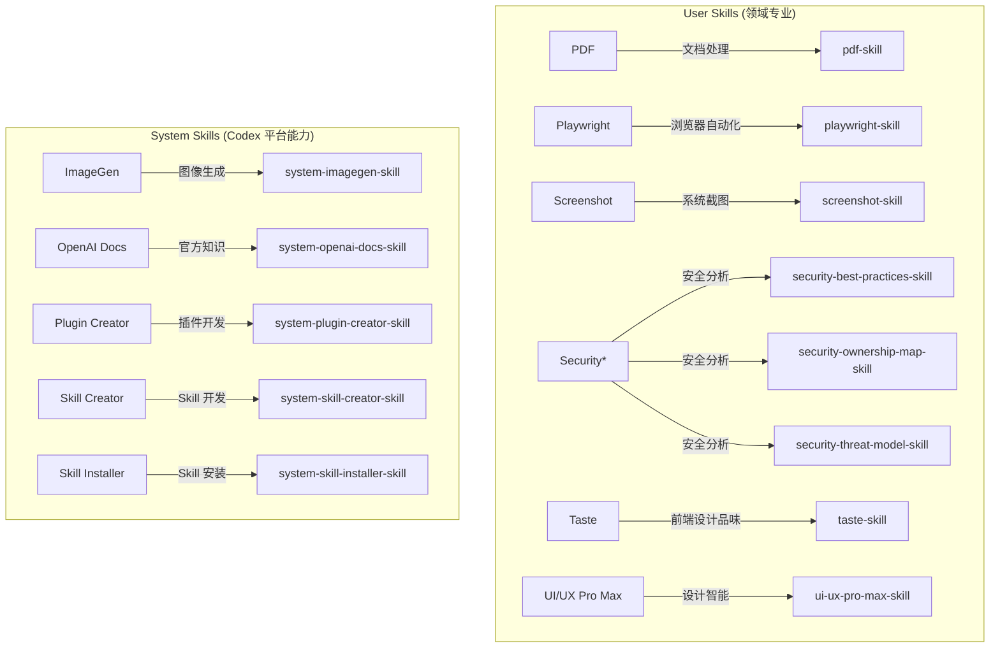

# Skills 索引

> 源自 Codex (`~/.codex/skills/`) 的技能体系，2026-07-12 导入
> 🧠 [[ai-rag-setup-guide\|AI RAG 系统配置指南]] — 本地语义搜索 + DeepSeek 问答

## 用户安装的 Skills

| Skill | 用途 | 源路径 |
|-------|------|--------|
| [[pdf-skill\|PDF]] | PDF 读取、生成、渲染检查 | `.codex/skills/pdf/` |
| [[playwright-skill\|Playwright]] | 浏览器自动化 CLI | `.codex/skills/playwright/` |
| [[screenshot-skill\|Screenshot]] | 桌面/系统截图 | `.codex/skills/screenshot/` |
| [[security-best-practices-skill\|Security Best Practices]] | 安全最佳实践审查 | `.codex/skills/security-best-practices/` |
| [[security-ownership-map-skill\|Security Ownership Map]] | Git 安全所有权映射 | `.codex/skills/security-ownership-map/` |
| [[security-threat-model-skill\|Security Threat Model]] | 威胁建模 | `.codex/skills/security-threat-model/` |
| [[taste-skill\|Taste Skill]] | 前端设计品味（防模板化） | `.codex/skills/taste-skill/` |
| [[ui-ux-pro-max-skill\|UI/UX Pro Max]] | UI/UX 设计智能库 | `.codex/skills/ui-ux-pro-max/` |
| [[linktec-skill\|LinkTec Skill]] | HydraTec/LinkTec 工业液压门户项目指南 | `.roo/skills/linktec/SKILL.md` |
| [[linktec-frontend-taste\|LinkTec Frontend Taste]] | B2B 工业门户前端设计品质指南 | `.roo/skills/linktec/FRONTEND_TASTE.md` |
| [[ai-rag-setup-guide\|AI RAG Setup Guide]] | 本地 RAG 系统配置与使用指南 | `ai-brain-rag/` |

## 预装 System Skills

| Skill | 用途 |
|-------|------|
| [[system-imagegen-skill\|ImageGen]] | 图像生成与编辑 |
| [[system-openai-docs-skill\|OpenAI Docs]] | OpenAI 文档查询与 Codex 手册 |
| [[system-plugin-creator-skill\|Plugin Creator]] | Codex 插件脚手架 |
| [[system-skill-creator-skill\|Skill Creator]] | Skill 创建指南 |
| [[system-skill-installer-skill\|Skill Installer]] | 安装 curated skills |

## 技能树关系

## 交叉引用

- [[../05 Architecture/codex-system-architecture|查看 Codex 系统架构]]
- [[../06 Decisions/codex-config-decisions|查看配置决策记录]]
- [[../06 Decisions/security-tools-decision-log|安全工具选择决策]]
- [[../06 Decisions/taste-skill-design-philosophy|Taste Skill 设计理念]]
- [[../07 Lessons/codex-lessons|使用经验与注意事项]]
- [[../00 Inbox/codex-import-2026-07-12|导入记录]]
- [[ai-rag-setup-guide|🧠 AI RAG 系统配置指南]]
