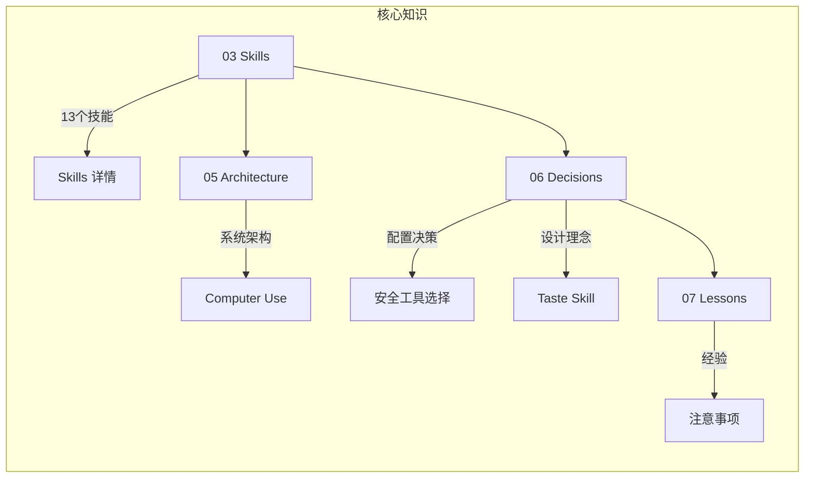

# AI-Brain 🧠

> Codex 配置知识库 · 最后更新：2026-07-12
> **远程仓库**: `git@github.com:albertlisage-ux/AI-Brain.git`

## Git Submodule 架构

```mermaid
graph TB
    subgraph "AI-Brain (父仓库)"
        direction LR
        AI[AI-Brain.git] -->|git submodule| LH[LinkTech-hydraulic]
        AI -->|git submodule| P2[更多项目...]
    end
    
    subgraph "独立代码仓库"
        LH -->|git@github.com:albertlisage-ux/LinkTech-hydraulic.git| CODE[实际项目代码]
        P2 -->|待添加| CODE2[...]
    end
    
    subgraph "AI-Brain 内部知识"
        SK[03 Skills] -->|记录工作流| NOTES[各 Skill 文档]
        AR[05 Architecture] -->|记录架构| NOTES2[系统设计文档]
        DC[06 Decisions] -->|记录决策| NOTES3[决策日志]
    end
    
    NOTES -.->|笔记引用项目| LH
    NOTES2 -.->|笔记引用项目| LH
```

> 每个项目在 `02 Projects/` 下有笔记文件（本仓库管理），
> 以及 `code/` 子目录（Git Submodule → 实际代码仓库）。

## 快速导航

| 目录 | 说明 |
|------|------|
| [[00 Inbox/codex-import-2026-07-12\|📥 00 Inbox]] | 待处理与导入记录 |
| [[01 Daily/\|📅 01 Daily]] | 每日记录 |
| [[02 Projects/LinkTech-hydraulic/_index\|📦 02 Projects]] | 项目笔记（含 LinkTech-hydraulic） |
| [[03 Skills/_index\|🔧 03 Skills]] | Skills 知识库（13 个） |
| [[04 Prompts/\|💬 04 Prompts]] | 提示词库 |
| [[05 Architecture/codex-system-architecture\|🏗 05 Architecture]] | 架构设计（2 篇） |
| [[06 Decisions/codex-config-decisions\|📐 06 Decisions]] | 决策记录（4 篇） |
| [[07 Lessons/codex-lessons\|📝 07 Lessons]] | 经验教训 |
| [[08 Templates/skill-analysis-template\|📋 08 Templates]] | 模板 |
| [[99 Archive/\|\| 🗄 99 Archive]] | 归档 |
| `Attachments/` | 附件 |

## 知识图谱总览



## 最近导入

- [[00 Inbox/codex-import-2026-07-12|2026-07-12: Codex 配置导入]] — 从 `~/.codex/` 导入 13 个 Skills + 架构 + 决策
- [[02 Projects/LinkTech-hydraulic/_index|2026-07-12: LinkTech-hydraulic 项目导入]] — 工业液压门户项目知识入库

---

> 💡 **提示**：在 Obsidian 中按下 `Cmd+O` 即可快速搜索跳转到任意笔记。
