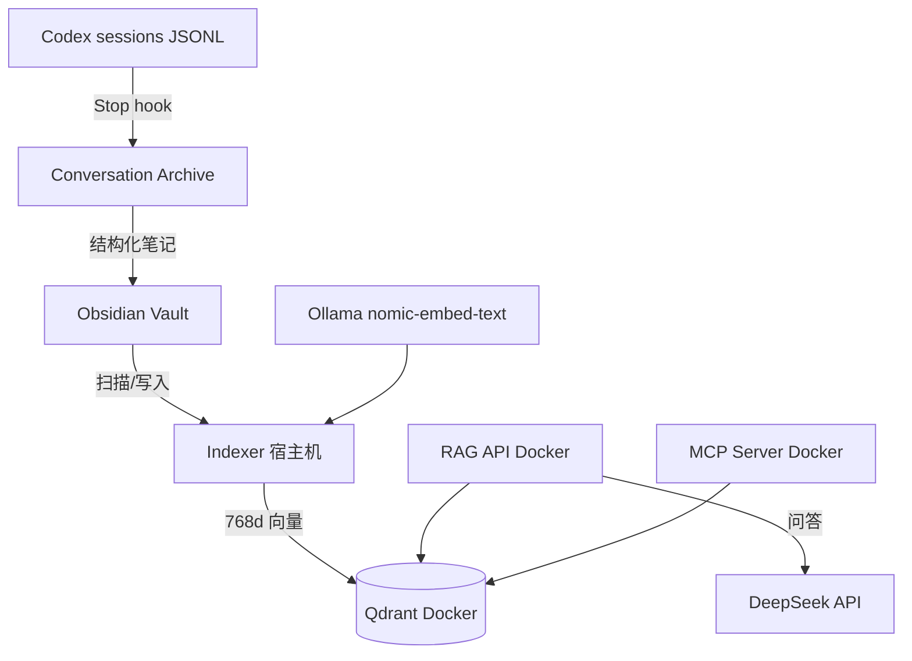

# AI-Brain 快速部署：Codex → Obsidian 自动归档 + Docker RAG

一份文件部署整套系统：**Codex 会话自动归档到 Obsidian** + **本地 RAG 语义搜索**（Qdrant 向量库 + RAG API + MCP Server + 宿主机索引器）。把本文件连同 `ai-brain-rag/` 目录复制到目标机器，按步骤执行即可。

## 架构



两条链路互不干扰：归档走「Stop hook → SQLite → worker → 摘要笔记」；搜索走「Ollama 嵌入 → Qdrant → API/MCP 查询」。

## 前置需求

| 工具 | 要求 | 用途 |
|------|------|------|
| macOS | Apple Silicon（Metal GPU 加速嵌入） | 宿主机索引器 |
| Docker & Docker Compose | ≥ 24.0 | Qdrant + RAG API + MCP Server |
| Ollama | ≥ 0.31 | 本地嵌入模型 |
| DeepSeek API Key | 有余额 | 摘要与问答 |
| Obsidian Vault | 本地目录 | 知识库 + 归档目标 |
| Codex CLI | 已登录 | 会话归档触发 |
| python3 | ≥ 3.12 | venv（归档纯标准库，无需第三方依赖） |

## 目录结构（部署目标）

```
ai-brain-rag/
├── docker-compose.yml        # qdrant + rag-api + mcp-server（不含 indexer）
├── .env.local                # 本地配置（gitignore，含密钥）
├── run-indexer-host.sh       # 宿主机索引器（Ollama Metal GPU）
├── conversation_archive/     # 归档模块（hook + worker + 摘要器）
├── indexer/ rag-api/ mcp-server/ playground.html
├── scripts/install-automation.sh    # 安装 hook + LaunchAgent
└── data/                     # 运行时：sqlite / qdrant / logs / indexer state
```

## Step 1 — 准备项目与 Python 环境

```bash
# 复制项目到目标机器后：
cd ai-brain-rag

# 创建 venv（归档模块纯标准库；索引器首次运行会自动补装 qdrant-client）
python3 -m venv .venv
```

## Step 2 — 配置环境变量

复制 `.env` 模板为 `.env.local` 并填写（**密钥只放 .env.local，勿提交 Git**）：

| 变量 | 说明 |
|------|------|
| `OBSIDIAN_VAULT_PATH` | Obsidian 库绝对路径（`OBSIDIAN_VAULT` 优先，二选一） |
| `DEEPSEEK_API_KEY` / `DEEPSEEK_API_BASE` / `DEEPSEEK_MODEL` | 摘要与问答的模型配置（默认 `https://api.deepseek.com/v1` / `deepseek-chat`） |
| `CONVERSATION_QUIET_SECONDS` | 会话静默期（默认 60s） |
| `CODEX_SESSIONS_ROOT` | 默认 `~/.codex/sessions` |
| `CONVERSATION_ARCHIVE_DB` | 归档 SQLite 路径（默认 `data/conversation-archive/state.sqlite3`） |
| `CODEX_CAPACITY_WARNING_BYTES` / `CODEX_CAPACITY_GROWTH_PERCENT` | 容量预警（默认 5 GiB / 20%） |
| `QDRANT_HOST/PORT/GRPC_PORT/COLLECTION` | 向量库连接（默认 localhost:6333 / 6334 / ai-brain） |
| `SCAN_INTERVAL` / `CHUNK_SIZE` / `CHUNK_OVERLAP` | 索引参数（默认 30s / 500 / 50） |

## Step 3 — 启动 Docker RAG（Qdrant + API + MCP）

```bash
docker compose --env-file .env.local up -d qdrant rag-api mcp-server

# 健康检查：期望 {"status":"ok","qdrant_connected":true,...}
curl http://localhost:8000/health
```

服务端口：Qdrant REST `127.0.0.1:6333`（dashboard 6333/dashboard）、gRPC 6334、RAG API `127.0.0.1:8000`、MCP SSE `127.0.0.1:8100`。

## Step 4 — 启动宿主机索引器（Ollama 嵌入）

```bash
# Ollama
brew services start ollama
ollama pull nomic-embed-text

# 前台启动索引器（Ctrl+C 停止；launchd 模式见 Step 5）
bash run-indexer-host.sh

# 确认向量数（total_points > 0）
curl http://localhost:8000/stats
```

> 全 Docker 方案（无 Ollama 时备选，速度慢）：在 docker-compose.yml 里取消 indexer 服务注释后 `docker compose --env-file .env.local up -d`。

## Step 5 — 安装 Codex 会话自动归档

```bash
# 幂等安装：Stop hook + 两个 LaunchAgent（conversation-archive、indexer）
bash scripts/install-automation.sh

# 检查服务
launchctl print gui/$(id -u)/com.yuanzhe.ai-brain-conversation-archive
launchctl print gui/$(id -u)/com.yuanzhe.ai-brain-indexer
```

机制：每次 Codex 回合结束（Stop）→ hook 仅把 session_id + transcript 路径写入 SQLite（不调模型、不阻塞）→ worker 静默 60s 后用 DeepSeek 生成摘要笔记 → 写入 `02 Projects/Codex Conversations/YYYY/MM/<日期>-<会话ID>.md`；每月容量报告写入 `.../Reports/`。原始 transcript 不会复制进 Vault。

> ⚠️ 新环境首次运行后，Codex 会提示信任该 Stop hook（hooks.json 信任校验）。不信任则不会触发归档——务必接受。

## Step 6 — 验证归档

```bash
# 1. 跑任意一轮 Codex 对话并结束回合
# 2. 等待约 1 分钟，检查笔记是否生成
find "<OBSIDIAN_VAULT_PATH>/02 Projects/Codex Conversations" -type f -mmin -5

# 3. 查看 worker 日志（失败任务会指数重试）
tail -f data/logs/conversation-archive.error.log
```

## Step 7 — MCP 接入（可选）

VS Code 的 `.vscode/mcp.json`（或 settings.json）：

```json
{ "mcpServers": { "ai-brain": { "url": "http://localhost:8100/sse" } } }
```

工具：`search_knowledge` / `read_note` / `list_notes` / `get_project_context` / `get_skill`。

## 验证清单

- [ ] `curl :8000/health` → qdrant_connected / model_loaded / deepseek_configured 全 true
- [ ] `curl :8000/stats` → total_points > 0
- [ ] `~/.codex/hooks.json` 含 `run-conversation-archive.sh --hook`
- [ ] `launchctl list | grep ai-brain` 两个服务都在
- [ ] 结束一轮对话后 1 分钟内 Vault 出现对应笔记

## 日常管理

```bash
docker compose --env-file .env.local logs -f      # RAG 日志
docker compose --env-file .env.local down          # 停止 RAG（数据保留在 data/qdrant）
launchctl kickstart -k gui/$(id -u)/com.yuanzhe.ai-brain-conversation-archive   # 重启归档
bash scripts/uninstall-automation.sh               # 卸载 LaunchAgent（保留数据/hook/笔记）
```

## 排错速查

| 症状 | 原因 | 解决 |
|------|------|------|
| 归档笔记没生成 | hook 未信任 / worker 失败 | 检查 hooks.json 与 conversation-archive.error.log |
| Ollama 连接失败 | Ollama 未启动 | `brew services start ollama` |
| Qdrant 连不上 | Docker 未启动 | `docker compose --env-file .env.local up -d` |
| 索引 0 个文件 | Vault 路径错误 | 检查 run-indexer-host.sh 的 `OBSIDIAN_VAULT` |
| 向量数为 0 | 首次索引未完成 | 等 30s 再看 `curl :8000/stats` |

## 安全说明

- 密钥（DeepSeek）只存在于 `.env.local`，Git 已忽略。
- 任何脚本都不会压缩、移动、修改或删除 `~/.codex/sessions`。
- 容量预警只提醒，不自动清理数据。
